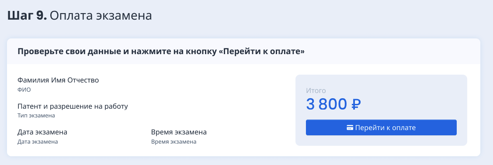

### Шаг 1. Включим уведомления

Включите уведомления, чтобы не пропустить важную информацию.

{width=1432px height=1020px}

### Шаг 2. Определим тип экзамена

Выберите тип экзамена, который будете сдавать.

{width=1426px height=678px}

### Шаг 3. Уточнение персональных данных

{width=1432px height=754px}

Заполните ваши персональные данные и загрузите сканы/фото хорошего качества, затем сохраните шаг 3.

### Шаг 4. Сканы документов

Сканы документов будут отправлены на проверку в выбранную экзаменационную площадку.

:::info 

В поля с документами можно загрузить сразу несколько файлов

:::

{width=1128px height=960px}

### Шаг 5. Проверка документов

На этом шаге ваши документы проверяются. Если они будут одобрены, то откроется шаг 5, если будут отклонены, то вы вернётесь на предыдущий шаг и документы необходимо будет заменить  на корректные, в соответствии с комментарием проверяющего. (Например, если вместо скана документа, удостоверяющего личности будет случайно загружена личная фотография, вас попросят заменить её на скан требуемого документа).

{width=1120px height=239px}

### Шаг 6. Выбор даты экзамена

Выберите удобную дату экзамена из списка.

{width=1125px height=410px}

### Шаг 7. Оформление заявления на принятие экзамена

Для вас будет сгенерировано заявление, его необходимо скачать, распечатать, подписать и загрузить скан-копию или фото на проверку.

:::info 

В поле с загрузкой заявления можно прикрепить сразу несколько файлов.

:::

{width=1122px height=840px}

### Шаг 8. Проверка заявления

Ваше заявление находится на проверке:

-  если оно будет одобрено, то вы попадёте на шаг 8 и сможете оплатить экзамен,

-  если будет отклонено, то его необходимо исправить и повторно отправить на проверку.

{width=1122px height=259px}

### Шаг 9. Оплата экзамена

Оперативно оплатите экзамен.

:::danger 

**Оплатить** экзамен можно только **с российской банковской карты**.

Если карты нет, её необходимо получить до оплаты в лк  ( или до визита в Центр Тестирования, если заявка подаётся в центре, так как оплата будет на первом посещении).

Например,  вы можете [получить карту Momentum в Сбербанке](https://www.sberbank.com/ru/person/bank_cards/debit/sberkarta_momentum), она будет выдана за 1 визит в банк. Прийти необходимо с паспортом.\
[Посмотреть отделения Сбербанка на карте.](https://yandex.ru/maps/11426/ussuriysk/chain/sberbank_atms/6003611/?ll=131.952120,43.797244&sll=131.952120,43.797244&sspn=0.189686,0.086043&z=13)

:::

{width=1128px height=378px}

### Шаг 10. Экзамен

{width=1123px height=976px}