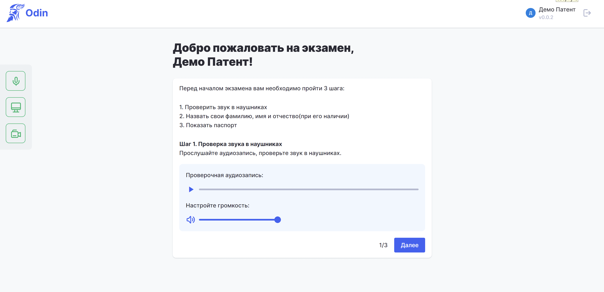

**Инструкция по работе с тренировочным приложением**

:::note 

**Внимание**: тренировочное приложение работает **только  на компьютере Windows**. Установка на другие системы в настоящее время невозможна.

:::

Перейдите[ **по ссылке** ](https://storage.yandexcloud.net/odin-exam-app/demo/win32/x64/Odin-0.0.0.exe)и сохраните тренировочное приложение на своё устройство.

Найдите сохранённый файл, дважды кликните по нему левой кнопкой мыши для открытия. Дождитесь полной загрузки программы, это может занять несколько минут.

{width=1834px height=1050px}

Укажите тот уровень экзамена, по которому планируете проходить подготовку.

{width=1160px height=1140px}

Все дальнейшие действия выполняйте согласно инструкциям, которые будет показывать приложение.

{width=2948px height=1426px}

**Желаем успешной подготовки!**